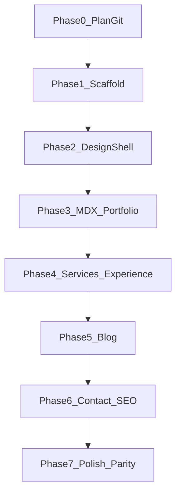

# Absolute Implementation Plan — Samundra Portfolio (Ink Studio)

This plan is the single source of truth for build execution. Every decision below is **locked**. Do not reopen stack/IA/design choices during implementation unless a batch fails acceptance.

---

## Locked decisions (non-negotiable)

| Decision | Lock |
| --- | --- |
| Workspace | Scaffold **in-place** in [`C:\Users\Samundra\Desktop\Code Workaround\NextJs\samundramahesh`](C:\Users\Samundra\Desktop\Code Workaround\NextJs\samundramahesh) (current Cursor root). Do **not** create `~/Projects/samundra-portfolio`. |
| Package manager | `npm` |
| Stack | Next.js **App Router** + TypeScript + Tailwind CSS + **Framer Motion** |
| MDX | `next-mdx-remote/rsc` + `gray-matter` + `remark-gfm` (file-based MDX under `content/`) |
| Contact | `POST /api/contact` via **Resend**; mailto fallback `mahesamun@gmail.com` |
| Brand | Personal portfolio first; Drone Hospital = service/venture only (no co-equal nav brand) |
| Design | **Ink Studio** tokens/typography exactly as in [`initial_plan.md`](initial_plan.md) |
| IA depth | Inspired by [rishikeshrana.com.np](https://rishikeshrana.com.np/) (section depth); **not** their visual density, sales/turnkey, or skill bars |
| Content source | Migrate from [samundra.dronehospitalnepal.com](https://samundra.dronehospitalnepal.com/) |
| Primary nav | Home · Portfolio · Services · Blog · Contact |
| Out of scope v1 | CMS, turnkey sales, social carousels as primary content, dual-brand Drone Hospital site |

### Routes (exact)

- `/` — home composition
- `/portfolio` — all projects
- `/portfolio/[slug]` — MDX case study
- `/services` — Flutter / UI-UX / Drone Hospital
- `/blog` — MDX index
- `/blog/[slug]` — MDX article
- `/contact` — form + email/socials/location
- `/api/contact` — Resend handler
- `/sitemap.xml`, `/robots.txt` — SEO

### Seed projects (exact slugs)

1. `trackify` — full case study + APK download links preserved
2. `falanocollege` — lighter case study
3. `couriermdirect` → slug **`courier-direct`** — lighter case study (delivery management app from live site)

### Seed blog posts (exact)

1. `building-trackify-privacy-first-finance` — dated 2025-11-01
2. `flutter-ui-micro-interactions` — dated 2026-01-15

### Contact / identity (exact)

- Name display: **Samundra Mahesh**
- Role line: Flutter Developer & UI/UX Designer
- Email: `mahesamun@gmail.com`
- Location: Kathmandu, Nepal (unless live site specifies otherwise at migrate time — then update `content/site.ts` only)
- Env: `RESEND_API_KEY`, `CONTACT_TO_EMAIL=mahesamun@gmail.com`, `NEXT_PUBLIC_SITE_URL`

---

## Target file tree (create exactly)

```text
samundramahesh/
├── app/
│   ├── layout.tsx
│   ├── page.tsx
│   ├── globals.css
│   ├── not-found.tsx
│   ├── robots.ts
│   ├── sitemap.ts
│   ├── portfolio/
│   │   ├── page.tsx
│   │   └── [slug]/page.tsx
│   ├── services/page.tsx
│   ├── blog/
│   │   ├── page.tsx
│   │   └── [slug]/page.tsx
│   ├── contact/page.tsx
│   └── api/contact/route.ts
├── components/
│   ├── SiteHeader.tsx
│   ├── SiteFooter.tsx
│   ├── Button.tsx
│   ├── TextLink.tsx
│   ├── Section.tsx
│   ├── WorkRow.tsx
│   ├── ServiceBlock.tsx
│   ├── ExperienceItem.tsx
│   ├── Prose.tsx
│   ├── ContactForm.tsx
│   ├── SelectedWork.tsx
│   ├── ServicesPreview.tsx
│   ├── ExperienceList.tsx
│   ├── SkipLink.tsx
│   └── motion/
│       ├── PageEnter.tsx
│       └── Reveal.tsx
├── content/
│   ├── site.ts
│   ├── services.ts
│   ├── experience.ts
│   ├── portfolio/
│   │   ├── trackify.mdx
│   │   ├── falanocollege.mdx
│   │   └── courier-direct.mdx
│   └── blog/
│       ├── building-trackify-privacy-first-finance.mdx
│       └── flutter-ui-micro-interactions.mdx
├── lib/
│   ├── mdx.ts
│   ├── portfolio.ts
│   ├── blog.ts
│   └── seo.ts
├── public/
│   ├── images/portfolio/...
│   └── og/default.png
├── .env.example
├── IMPLEMENTATION_PLAN.md   ← this plan written to disk in Batch 0
└── initial_plan.md
```

### Component inventory (thin — do not invent Card/Badge/StatStrip)

`SiteHeader`, `SiteFooter`, `Button`, `TextLink`, `Section`, `WorkRow`, `ServiceBlock`, `ExperienceItem`, `Prose`, `ContactForm`, plus home helpers `SelectedWork`, `ServicesPreview`, `ExperienceList`, `SkipLink`, motion helpers only.

### Design tokens (exact CSS variables in `globals.css`)

```css
--bg: #070B12;
--bg-elevated: #0E1522;
--fg: #E8EEF7;
--muted: #8B97AB;
--accent: #5EC8E8;
--accent-dim: rgba(94, 200, 232, 0.35);
--line: rgba(232, 238, 247, 0.08);
--danger: #F07178;
--success: #7FD99A;
```

Fonts via `next/font/google`: **Syne** (display), **DM Sans** (body), **JetBrains Mono** (mono).

Motion (exactly 3): (1) route enter opacity/y, (2) nav active indicator slide, (3) selected-work image/title reveal on scroll or hover.

---

## Execution protocol (every batch)

1. Run **only** the batch prompt below.
2. Do not start the next batch until **Acceptance** passes.
3. Prefer editing existing files over drive-by refactors.
4. After each phase: `npm run build` must succeed.
5. Commit only when the user asks (do not auto-commit).

---

## Phase 0 — Persist plan + git baseline

### Batch 0.1 — Write plan file + init repo

**Goal:** Persist this absolute plan and initialize git if missing.

**Prompt (copy-paste):**

```text
You are implementing Samundra’s portfolio per IMPLEMENTATION_PLAN.md (absolute plan). 

TASK — Batch 0.1 only:
1. Write the full absolute implementation plan content into IMPLEMENTATION_PLAN.md at the repo root (phases, batches, locked decisions, prompts, acceptance). Mirror what was approved in the Cursor plan.
2. If git is not initialized, run git init. Do not create commits unless I ask.
3. Ensure .gitignore covers node_modules, .next, .env, .env.local.
4. Do not scaffold Next.js yet.

Acceptance: IMPLEMENTATION_PLAN.md exists; .gitignore present; no Next.js app yet.
```

**Acceptance:** `IMPLEMENTATION_PLAN.md` on disk; safe `.gitignore`; no app scaffold yet.

---

## Phase 1 — Scaffold

### Batch 1.1 — Create Next.js app in current folder

**Goal:** Working Next.js + TS + Tailwind + Framer Motion baseline.

**Prompt:**

```text
Batch 1.1 — Scaffold only (see IMPLEMENTATION_PLAN.md Phase 1).

In the current workspace root (samundramahesh), create a Next.js App Router + TypeScript + Tailwind CSS app IN PLACE (do not nest an extra folder). Preserve initial_plan.md and IMPLEMENTATION_PLAN.md.

Commands/approach:
- Use create-next-app with App Router, TypeScript, Tailwind, ESLint, app/ directory, no src/, import alias @/*
- Install: framer-motion, next-mdx-remote, gray-matter, remark-gfm, resend, zod
- DevDep as needed for MDX types

Replace default page with a minimal placeholder that says "Samundra Mahesh" so the app boots.
Add .env.example with RESEND_API_KEY, CONTACT_TO_EMAIL, NEXT_PUBLIC_SITE_URL.

Acceptance: npm run dev works; npm run build works; Tailwind styles apply; listed packages installed; plan markdown files retained.
```

**Acceptance:** `npm run build` green; packages installed; plans retained.

---

## Phase 2 — Design system + shell

### Batch 2.1 — Tokens, fonts, globals, primitives

**Prompt:**

```text
Batch 2.1 — Ink Studio tokens + primitives (IMPLEMENTATION_PLAN.md).

Implement exactly:
1. app/globals.css — CSS variables: --bg #070B12, --bg-elevated #0E1522, --fg #E8EEF7, --muted #8B97AB, --accent #5EC8E8, --accent-dim, --line, --danger, --success. Base body on --bg/--fg. No purple gradients, no cream/terracotta, no newspaper grids.
2. app/layout.tsx — next/font: Syne (display), DM Sans (body), JetBrains Mono (mono); wire CSS variables; metadata title template "%s · Samundra Mahesh".
3. Components: Button (primary filled accent + secondary text/underline), TextLink, Section (optional eyebrow + ONE headline + ONE supporting line), SkipLink.
4. Max content width ~1120px utility/class; prose width ~65ch class for later.

Do not build header/footer/pages yet beyond layout shell.

Acceptance: tokens visible in DevTools; fonts load; Button/TextLink/Section/SkipLink render on a temporary layout smoke test or home placeholder.
```

**Acceptance:** Tokens + fonts + primitives exist and match locks.

### Batch 2.2 — Header, footer, nav motion

**Prompt:**

```text
Batch 2.2 — SiteHeader + SiteFooter + nav active motion.

Nav items EXACT: Home (/), Portfolio (/portfolio), Services (/services), Blog (/blog), Contact (/contact). No product names in nav. No Drone Hospital as co-brand.

SiteHeader: skip link target #main; visible focus rings using accent; active route indicator slides (Framer Motion layoutId) — this is motion #2.
SiteFooter: name, short role line, email mahesamun@gmail.com, nav repeats, copyright year.

Wire header/footer into app/layout.tsx. Main landmark id="main".

Create placeholder route pages for portfolio, services, blog, contact that only render Section with page title so nav works.

Acceptance: all nav links work; active indicator animates; keyboard focus visible; mobile nav usable (simple collapse or stacked — no pill clusters).
```

**Acceptance:** Shell navigation complete across 5 routes.

### Batch 2.3 — Home hero composition only

**Prompt:**

```text
Batch 2.3 — Home hero ONLY (first viewport). Follow UX rules strictly.

First viewport = ONE composition:
- Brand signal loudest: "Samundra Mahesh" (Syne display)
- ONE headline (must not overpower brand)
- ONE supporting sentence (Flutter / UI-UX / Drone Hospital founder — personal brand first)
- ONE CTA group: primary → /portfolio, secondary → /contact
- ONE dominant full-bleed visual plane/background (atmospheric ink wash + optional abstract device silhouette or real photo if available in public/). NO inset hero cards, NO service cards, NO stats, NO overlays/badges/chips.

Soft radial wash allowed for atmosphere only.
Add PageEnter motion wrapper (opacity/y) — motion #1.

Leave below-fold sections as empty placeholders with comments for later batches.

Acceptance: brand-test passes (remove nav → still clearly Samundra); hero is full-bleed; build passes.
```

**Acceptance:** Hero matches UX rules; motion #1 present.

---

## Phase 3 — MDX pipeline + Portfolio

### Batch 3.1 — MDX lib + content helpers

**Prompt:**

```text
Batch 3.1 — MDX content pipeline.

Create:
- content/portfolio/*.mdx and content/blog/*.mdx folders
- lib/mdx.ts — read file, gray-matter parse, compile with next-mdx-remote/rsc + remark-gfm
- lib/portfolio.ts — listPortfolio(), getPortfolioBySlug(slug), getFeaturedPortfolio()
- lib/blog.ts — listPosts(), getPostBySlug(slug)
- Frontmatter types:
  Portfolio: title, summary, role, stack: string[], status, links: {label, href}[], cover, featured: boolean
  Blog: title, date, summary, tags: string[]

Add stub trackify.mdx with minimal frontmatter so helpers can be unit-smoked via a temporary server log or typed compile.

Acceptance: helpers return typed data; invalid slug returns null; no UI pages required beyond compile safety.
```

**Acceptance:** MDX read/compile path works for portfolio + blog.

### Batch 3.2 — Portfolio list + WorkRow + Trackify case study

**Prompt:**

```text
Batch 3.2 — Portfolio UI + Trackify full case study.

1. Migrate Trackify copy from https://samundra.dronehospitalnepal.com/ into content/portfolio/trackify.mdx (full case study depth). Preserve APK download link(s) in frontmatter links and render a clear download CTA on the case study page (interactive container OK — not a decorative card grid).
2. Add lighter MDX for falanocollege and courier-direct with honest summaries (role/stack/status); mark trackify featured: true.
3. components/WorkRow.tsx — list row composition (title, summary, stack mono tags), NOT equal card tiles.
4. app/portfolio/page.tsx — list all projects via WorkRow.
5. app/portfolio/[slug]/page.tsx — generateStaticParams; Prose MDX body; metadata from frontmatter.
6. Motion #3: reveal on SelectedWork / WorkRow hover or scroll for image/title.

Acceptance: /portfolio lists 3 projects; /portfolio/trackify shows full MDX + APK links; build lists static params; no card chrome.
```

**Acceptance:** Three projects live; Trackify is deep; APK preserved.

### Batch 3.3 — Home below-fold: SelectedWork

**Prompt:**

```text
Batch 3.3 — Wire SelectedWork on home below hero.

SelectedWork: featured projects from lib/portfolio (Trackify + up to 2 others). List/composition layout linking to case studies. One section job only: headline + one line + work rows. No service content here.

Acceptance: home shows selected work; links resolve; still no services cards under hero.
```

**Acceptance:** Home selected work section complete.

---

## Phase 4 — Services + Experience

### Batch 4.1 — Content modules

**Prompt:**

```text
Batch 4.1 — content/services.ts + content/experience.ts + content/site.ts.

site.ts: name, role, email, location, socials (from live site if present), short bio.
services.ts: three blocks — Flutter apps; UI/UX; Drone Hospital (repair / maintenance / training). Personal portfolio framing; DH is a venture service, not co-brand.
experience.ts: migrate career entries from live site into structured items {company, role, period, location?, bullets[], skills[]}. Tonality like Rishikesh depth but calmer — no skill percentage bars, no turnkey sales.

Acceptance: typed exports only; no UI yet beyond types compiling.
```

**Acceptance:** Structured content modules ready.

### Batch 4.2 — Services page + home ServicesPreview

**Prompt:**

```text
Batch 4.2 — Services page + ServicesPreview.

components/ServiceBlock.tsx — compositional blocks separated by hairlines/spacing, NOT 3 equal marketing cards.
app/services/page.tsx — one page title section + ServiceBlocks from content/services.ts.
Home ServicesPreview — short list → /services; place AFTER SelectedWork; one job only.

Acceptance: /services readable; home preview is list/composition not card stack under hero.
```

**Acceptance:** Services surface complete.

### Batch 4.3 — Experience on home (+ optional dedicated section only on home)

**Prompt:**

```text
Batch 4.3 — ExperienceList + ExperienceItem.

Implement timeline/accordion (accessible): one open panel at a time OR simple expanding rows. Use content/experience.ts. Place on home after services preview. No skill bars. No testimonials unless already on live site for Samundra (do not invent).

Acceptance: keyboard accessible expand/collapse; content accurate to migrated data.
```

**Acceptance:** Experience snapshot on home.

---

## Phase 5 — Blog

### Batch 5.1 — Seed posts + blog routes

**Prompt:**

```text
Batch 5.1 — Blog index/detail + 2 seed MDX posts.

Create:
- content/blog/building-trackify-privacy-first-finance.mdx
- content/blog/flutter-ui-micro-interactions.mdx
Real, useful short posts (not lorem). Frontmatter complete.

app/blog/page.tsx — date-sorted list (mono dates, Syne titles).
app/blog/[slug]/page.tsx — Prose + generateStaticParams + metadata.
Home: blog teaser section (latest 2) after experience — one headline, one line, links.

Acceptance: both posts render; empty-blog problem solved; home teaser works.
```

**Acceptance:** Blog fully usable with 2 posts.

---

## Phase 6 — Contact + SEO

### Batch 6.1 — Contact form + API

**Prompt:**

```text
Batch 6.1 — Contact page + Resend API.

app/contact/page.tsx: email, location, socials from site.ts; ContactForm as the rare interactive card/surface.
Fields: name, email, message. Client validation with zod. POST /api/contact.
app/api/contact/route.ts: validate body; send via Resend to CONTACT_TO_EMAIL; return JSON errors safely; rate-limit lightly (simple in-memory or hop-by-hop headers OK for v1).
If RESEND_API_KEY missing: API returns 503 with message; UI shows mailto fallback to mahesamun@gmail.com.

Acceptance: happy path works with key; without key, mailto fallback UX clear; no secrets committed.
```

**Acceptance:** Contact path production-safe for v1.

### Batch 6.2 — SEO + sitemap + OG

**Prompt:**

```text
Batch 6.2 — SEO polish.

lib/seo.ts helpers for metadata.
Per-route metadata (title/description).
app/sitemap.ts includes home, portfolio, each project slug, services, blog, each post, contact.
app/robots.ts allows all; sitemap URL from NEXT_PUBLIC_SITE_URL.
Basic OG: use public/og/default.png (create a simple branded PNG or SVG→PNG placeholder). Dynamic OG optional later — not required for v1 if default OG exists.

Acceptance: metadata tags present; /sitemap.xml and /robots.txt resolve.
```

**Acceptance:** SEO baseline shipped.

---

## Phase 7 — Polish + content parity

### Batch 7.1 — Motion audit + a11y + responsive

**Prompt:**

```text
Batch 7.1 — Polish pass.

Verify exactly 3 intentional motions (page enter, nav indicator, work reveal). Remove any decorative motion noise.
A11y: skip link, focus rings, accordion keyboard, form errors announced, color contrast on muted/accent.
Responsive: hero, lists, header from 375px → desktop. No horizontal scroll.
npm run build must pass.

Acceptance: checklist above verified; build green.
```

### Batch 7.2 — Final migrate from live site + assets

**Prompt:**

```text
Batch 7.2 — Content/asset parity with https://samundra.dronehospitalnepal.com/.

Pull remaining copy, images, APK link accuracy, project names, and bio into MDX/ts/public. Do not invent testimonials or employers. Keep Drone Hospital as services content only. Remove leftovers from create-next-app defaults.

Acceptance: no placeholder lorem; Trackify APK works; visual assets load; build green.
```

### Batch 7.3 — Home contact CTA close

**Prompt:**

```text
Batch 7.3 — Final home section: contact CTA only (headline + one line + CTA to /contact). Ensure home section order EXACTLY:

1. Hero (viewport 1)
2. SelectedWork
3. ServicesPreview
4. ExperienceList
5. Blog teaser
6. Contact CTA

Acceptance: order exact; each section one job; hero uncluttered.
```

---

## Phase map (summary)



| Phase | Batches | Outcome |
| --- | --- | --- |
| 0 | 0.1 | Plan on disk + gitignore |
| 1 | 1.1 | Next.js app boots |
| 2 | 2.1–2.3 | Ink Studio + shell + hero |
| 3 | 3.1–3.3 | MDX + portfolio + home work |
| 4 | 4.1–4.3 | Services + experience |
| 5 | 5.1 | Blog live |
| 6 | 6.1–6.2 | Contact + SEO |
| 7 | 7.1–7.3 | Polish + parity + home CTA |

---

## Definition of done (v1)

- All routes in the site map render real content (no lorem)
- Trackify case study + APK download preserved
- Blog has ≥2 posts
- Contact works with Resend or graceful mailto fallback
- Ink Studio tokens/fonts/motion rules respected
- `npm run build` succeeds
- Out-of-scope items absent (CMS, turnkey sales, dual-brand DH marketing site)

