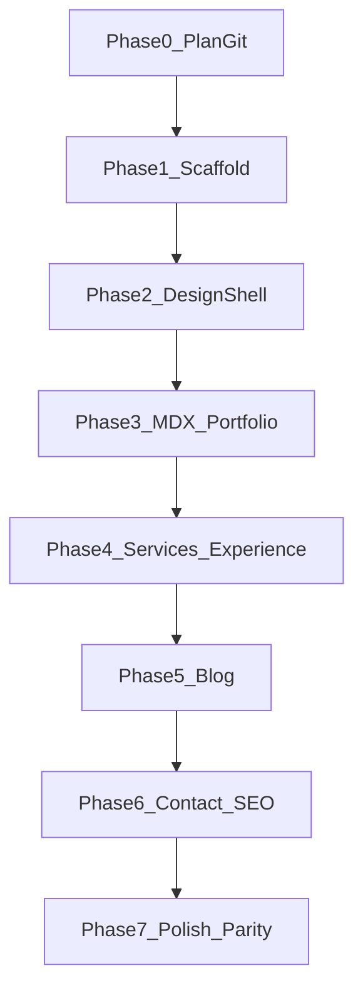

# Implementation Docs — Samundra Portfolio (Ink Studio)

Run the portfolio build **one batch at a time**. Each phase file has copy-paste agent prompts and acceptance criteria. Do not reopen stack, IA, or design choices unless a batch fails acceptance.

Product brief: [`initial_plan.md`](../../initial_plan.md). Locked decisions live here; phase files reference this README.

---

## Locked decisions (non-negotiable)

| Decision | Lock |
| --- | --- |
| Workspace | Scaffold **in-place** in `C:\Users\Samundra\Desktop\Code Workaround\NextJs\samundramahesh` (current Cursor root). Do **not** create `~/Projects/samundra-portfolio`. |
| Package manager | `npm` |
| Stack | Next.js **App Router** + TypeScript + Tailwind CSS + **Framer Motion** |
| MDX | `next-mdx-remote/rsc` + `gray-matter` + `remark-gfm` (file-based MDX under `content/`) |
| Contact | `POST /api/contact` via **Resend**; mailto fallback `mahesamun@gmail.com` |
| Brand | Personal portfolio first; Drone Hospital = service/venture only (no co-equal nav brand) |
| Design | **Ink Studio** tokens/typography exactly as in [`initial_plan.md`](../../initial_plan.md) |
| IA depth | Inspired by [rishikeshrana.com.np](https://rishikeshrana.com.np/) (section depth); **not** their visual density, sales/turnkey, or skill bars |
| Content source | Migrate from [samundra.dronehospitalnepal.com](https://samundra.dronehospitalnepal.com/) |
| Primary nav | Home · Portfolio · Services · Blog · Contact |
| Out of scope v1 | CMS, turnkey sales, social carousels as primary content, dual-brand Drone Hospital site |

### Routes (exact)

- `/` — home composition
- `/portfolio` — all projects
- `/portfolio/[slug]` — MDX case study
- `/services` — Flutter / UI-UX / Drone Hospital
- `/blog` — MDX index
- `/blog/[slug]` — MDX article
- `/contact` — form + email/socials/location
- `/api/contact` — Resend handler
- `/sitemap.xml`, `/robots.txt` — SEO

### Seed projects (exact slugs)

1. `trackify` — full case study + APK download links preserved
2. `falanocollege` — lighter case study
3. slug **`courier-direct`** — lighter case study (delivery management app from live site)

### Seed blog posts (exact)

1. `building-trackify-privacy-first-finance` — dated 2025-11-01
2. `flutter-ui-micro-interactions` — dated 2026-01-15

### Contact / identity (exact)

- Name display: **Samundra Mahesh**
- Role line: Flutter Developer & UI/UX Designer
- Email: `mahesamun@gmail.com`
- Location: Kathmandu, Nepal (unless live site specifies otherwise at migrate time — then update `content/site.ts` only)
- Env: `RESEND_API_KEY`, `CONTACT_TO_EMAIL=mahesamun@gmail.com`, `NEXT_PUBLIC_SITE_URL`

---

## Target file tree

```text
samundramahesh/
├── app/
│   ├── layout.tsx
│   ├── page.tsx
│   ├── globals.css
│   ├── not-found.tsx
│   ├── robots.ts
│   ├── sitemap.ts
│   ├── portfolio/
│   │   ├── page.tsx
│   │   └── [slug]/page.tsx
│   ├── services/page.tsx
│   ├── blog/
│   │   ├── page.tsx
│   │   └── [slug]/page.tsx
│   ├── contact/page.tsx
│   └── api/contact/route.ts
├── components/
│   ├── SiteHeader.tsx
│   ├── SiteFooter.tsx
│   ├── Button.tsx
│   ├── TextLink.tsx
│   ├── Section.tsx
│   ├── WorkRow.tsx
│   ├── ServiceBlock.tsx
│   ├── ExperienceItem.tsx
│   ├── Prose.tsx
│   ├── ContactForm.tsx
│   ├── SelectedWork.tsx
│   ├── ServicesPreview.tsx
│   ├── ExperienceList.tsx
│   ├── SkipLink.tsx
│   └── motion/
│       ├── PageEnter.tsx
│       └── Reveal.tsx
├── content/
│   ├── site.ts
│   ├── services.ts
│   ├── experience.ts
│   ├── portfolio/
│   │   ├── trackify.mdx
│   │   ├── falanocollege.mdx
│   │   └── courier-direct.mdx
│   └── blog/
│       ├── building-trackify-privacy-first-finance.mdx
│       └── flutter-ui-micro-interactions.mdx
├── lib/
│   ├── mdx.ts
│   ├── portfolio.ts
│   ├── blog.ts
│   └── seo.ts
├── public/
│   ├── images/portfolio/...
│   └── og/default.png
├── .env.example
├── IMPLEMENTATION_PLAN.md
└── initial_plan.md
```

### Component inventory (thin — do not invent Card/Badge/StatStrip)

`SiteHeader`, `SiteFooter`, `Button`, `TextLink`, `Section`, `WorkRow`, `ServiceBlock`, `ExperienceItem`, `Prose`, `ContactForm`, plus home helpers `SelectedWork`, `ServicesPreview`, `ExperienceList`, `SkipLink`, motion helpers only.

### Design tokens (exact CSS variables in `globals.css`)

```css
--bg: #070B12;
--bg-elevated: #0E1522;
--fg: #E8EEF7;
--muted: #8B97AB;
--accent: #5EC8E8;
--accent-dim: rgba(94, 200, 232, 0.35);
--line: rgba(232, 238, 247, 0.08);
--danger: #F07178;
--success: #7FD99A;
```

Fonts via `next/font/google`: **Syne** (display), **DM Sans** (body), **JetBrains Mono** (mono).

Motion (exactly 3): (1) route enter opacity/y, (2) nav active indicator slide, (3) selected-work image/title reveal on scroll or hover.

---

## Execution protocol (every batch)

1. Run **only** the batch prompt in the phase file.
2. Do not start the next batch until **Acceptance** passes.
3. Prefer editing existing files over drive-by refactors.
4. After each phase (Phase 1+): `npm run build` must succeed.
5. Commit only when the user asks (do not auto-commit).

---

## Phase index

| Phase | File | Batches | Outcome |
| --- | --- | --- | --- |
| 0 | [phase-00-persist-plan.md](./phase-00-persist-plan.md) | 0.1 | Plan on disk + gitignore |
| 1 | [phase-01-scaffold.md](./phase-01-scaffold.md) | 1.1 | Next.js app boots |
| 2 | [phase-02-design-shell.md](./phase-02-design-shell.md) | 2.1–2.3 | Ink Studio + shell + hero |
| 3 | [phase-03-mdx-portfolio.md](./phase-03-mdx-portfolio.md) | 3.1–3.3 | MDX + portfolio + home work |
| 4 | [phase-04-services-experience.md](./phase-04-services-experience.md) | 4.1–4.3 | Services + experience |
| 5 | [phase-05-blog.md](./phase-05-blog.md) | 5.1 | Blog live |
| 6 | [phase-06-contact-seo.md](./phase-06-contact-seo.md) | 6.1–6.2 | Contact + SEO |
| 7 | [phase-07-polish-parity.md](./phase-07-polish-parity.md) | 7.1–7.3 | Polish + parity + home CTA |



---

## Definition of done (v1)

- All routes in the site map render real content (no lorem)
- Trackify case study + APK download preserved
- Blog has ≥2 posts
- Contact works with Resend or graceful mailto fallback
- Ink Studio tokens/fonts/motion rules respected
- `npm run build` succeeds
- Out-of-scope items absent (CMS, turnkey sales, dual-brand DH marketing site)
