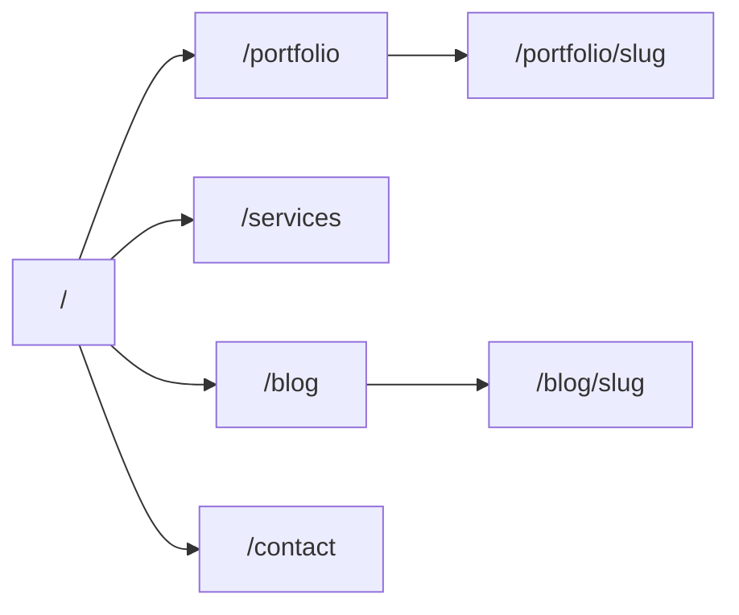

---

name: Next.js Portfolio Rework
overview: Rebuild Samundra’s personal portfolio as a Next.js App Router site with Portfolio, Services, and Blog — MDX-backed content, Rishikesh-style information depth, and a minimal unique visual system that follows your UX rules.
todos:

- id: scaffold
content: Create samundra-portfolio Next.js app, git init, move_agent_to_root
status: pending
- id: design-shell
content: Design tokens, layout, header/footer, home hero composition
status: pending
- id: mdx-portfolio
content: MDX pipeline + portfolio list/case studies (Trackify first)
status: pending
- id: services-experience
content: Services page + experience/skills content from existing site
status: pending
- id: blog
content: Blog index/detail + seed MDX posts
status: pending
- id: contact-seo
content: Contact form/API, SEO metadata, motion + responsive polish
status: pending
isProject: false

---

# Next.js Portfolio Rework

## Decisions locked

- **Brand:** Personal portfolio first; Drone Hospital is a service/venture, not co-equal branding
- **Content:** MDX in-repo for case studies + blog posts
- **IA inspiration:** [rishikeshrana.com.np](https://rishikeshrana.com.np/) (section depth, not visual density/sales clutter)
- **Source of truth for copy/assets:** existing [samundra.dronehospitalnepal.com](https://samundra.dronehospitalnepal.com/)

## Project setup

- Create `~/Projects/samundra-portfolio` (or `~/` if Projects does not exist), `git init`, then `move_agent_to_root` before scaffolding
- Stack: **Next.js (App Router) + TypeScript + Tailwind CSS + MDX (**`next-mdx-remote` **or** `@next/mdx`**) + Framer Motion** for 2–3 intentional motions
- Deploy target later: same domain or Vercel; not blocking v1

## Site map

| Route               | Purpose                                                                                                               |
| ------------------- | --------------------------------------------------------------------------------------------------------------------- |
| `/`                 | Hero (brand-first) + short intro + selected work + services preview + experience snapshot + blog teaser + contact CTA |
| `/portfolio`        | All projects grid/list (Trackify, falanocollege, CourierDirect)                                                       |
| `/portfolio/[slug]` | MDX case study (Trackify first; others lighter)                                                                       |
| `/services`         | Flutter apps, UI/UX, Drone Hospital (repair / maintenance / training)                                                 |
| `/blog`             | Index of MDX posts                                                                                                    |
| `/blog/[slug]`      | Article                                                                                                               |
| `/contact`          | Form + email/socials/location                                                                                         |

Nav: **Home · Portfolio · Services · Blog · Contact** — no product names in primary nav.

## Content model (MDX)

- `content/portfolio/*.mdx` — frontmatter: `title`, `summary`, `role`, `stack[]`, `status`, `links`, `cover`, `featured`
- `content/blog/*.mdx` — frontmatter: `title`, `date`, `summary`, `tags[]`
- `content/services.ts` + `content/experience.ts` — structured data for services and career (editable without CMS)
- Seed from current site: Trackify full case study, project blurbs, Drone Hospital service bullets; 1–2 placeholder blog posts so Blog is not empty

## Design system: “Ink Studio”

A **token-first, composition-led** system — small surface set, strong type hierarchy, almost no card chrome. Built for a Flutter/UI designer’s portfolio: calm, precise, slightly editorial.

### Philosophy

- **Composition over components:** pages are layouts of type + image + space, not widget catalogs
- **One accent, one mood:** ink dark + single cool accent; no purple gradients, cream/terracotta, or newspaper grids
- **Cards are rare:** only for interactive containers (contact form, download chooser)
- **Brand-first hero:** name is the loudest signal; headline never overpowers it

### Color tokens (CSS variables)

- `--bg` ink `#070B12` · `--bg-elevated` `#0E1522` (subtle, not card panels everywhere)
- `--fg` `#E8EEF7` · `--muted` `#8B97AB`
- `--accent` soft cyan `#5EC8E8` · `--accent-dim` for borders/focus rings
- `--line` hairline `rgba(232,238,247,0.08)` — dividers instead of boxed cards
- `--danger` / `--success` only for form states

### Typography

- **Display:** Syne (expressive, geometric) — brand name, page titles
- **Body:** DM Sans — UI, paragraphs, nav
- **Mono:** JetBrains Mono — stack tags, metadata, APK sizes
- Scale: `display` / `h1`–`h3` / `body` / `small` / `caption` with tight display tracking, generous body line-height

### Space & layout

- Max content width ~1120px; prose ~65ch on blog/case studies
- Vertical rhythm: section gaps `6–10rem`; hero owns full first viewport
- Grid: asymmetric home (type left / full-bleed visual right or behind); list-based portfolio/services, not equal card tiles

### Surfaces & interaction

- Primary CTA: filled accent; secondary: text + underline/arrow (no ghost pill stacks)
- Focus: visible accent ring; skip-to-content link
- Borders: hairlines and spacing, not shadows; soft radial wash only in hero atmosphere
- Icons: sparse line icons; no emoji, no pill clusters, no stat strips in hero

### Motion (2–3 only)

1. Route enter: short opacity/y fade
2. Nav: active indicator slide
3. Selected work: image/title reveal on scroll or hover

### Component inventory (thin)

`SiteHeader`, `SiteFooter`, `Button`, `TextLink`, `Section` (eyebrow + one headline + one line), `WorkRow`, `ServiceBlock`, `ExperienceItem`, `Prose` (MDX), `ContactForm` — no generic Card/Badge/StatStrip kit

### UX rules applied

- First viewport = one composition: brand, one headline, one supporting line, one CTA group, one dominant full-bleed visual
- No service cards in the hero
- Sections = one job each
- Motion supports hierarchy, not decoration

## Key UI pieces

- Shared `SiteHeader` / `SiteFooter`, skip link, focus states
- `SelectedWork` on home → links to case studies
- `ServicesPreview` → `/services` (list/composition, not 3 equal cards stacked under hero)
- Experience accordion or timeline (inspired by Rishikesh, toned down)
- Contact form → API route (`/api/contact`) with Resend or Formspree; mailto fallback (`mahesamun@gmail.com`)
- SEO: metadata per route, OG images, sitemap, robots
- Preserve APK download links for Trackify on case study page

## Implementation order

1. Scaffold Next.js project in new folder + move workspace root
2. Design tokens, layout shell, typography, home hero composition
3. MDX pipeline + Portfolio list/detail (migrate Trackify)
4. Services + experience content pages
5. Blog index/detail + 1–2 seed posts
6. Contact form + API
7. Polish motion, a11y, SEO, responsive pass; migrate remaining copy/assets from live site

## Out of scope for v1

- Headless CMS / admin panel
- Turnkey product sales section
- Heavy social-media carousels as primary content
- Dual-brand Drone Hospital marketing site (can link out to existing workshop presence)

